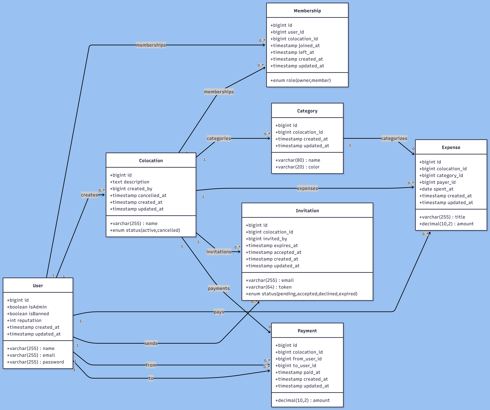

# EasyColoc — Plateforme Web de Gestion de Colocation

EasyColoc est une application web de gestion de colocation qui permet de suivre les dépenses communes et de répartir automatiquement les dettes entre membres.
L’objectif est d’éviter les calculs manuels et d’avoir une vision claire de **« qui doit quoi à qui »**.

---

## Table des Matières

- [Screenshots](#screenshots)
- [Contexte du Projet](#contexte-du-projet)
- [Objectifs](#objectifs)
- [Périmètre Réalisé](#périmètre-réalisé)
- [Acteurs et Rôles](#acteurs-et-rôles)
- [Fonctionnalités Clés](#fonctionnalités-clés)
- [User Stories](#user-stories)
- [Scénarios d’Implémentation](#scénarios-dimplémentation)
- [Stack Technique](#stack-technique)
- [Installation et Lancement](#installation-et-lancement)
- [Livrables](#livrables)
- [Méthodes d’Évaluation](#méthodes-dévaluation)
- [Critères de Performance](#critères-de-performance)

---

## Screenshots

### Capture d'écran de l'application


### Diagramme des cas d’utilisations


### Diagramme de classes



---

## Contexte du Projet

### Version actuelle permet

- Création de colocations et gestion des membres
- Invitation via lien/token (avec envoi email)
- Ajout et suppression de dépenses avec catégories
- Calcul automatique des soldes et remboursements simplifiés
- Enregistrement des paiements via **« Marquer payé »**
- Système de réputation selon le comportement financier
- Administration globale (statistiques, bannissement/débannissement)
- Filtrage des dépenses par mois dans la page d’une colocation

---

## Objectifs

### 1) Objectifs fonctionnels

- Gérer des colocations (création, annulation, départ/retrait de membres)
- Suivre les dépenses partagées
- Calculer automatiquement les soldes individuels
- Afficher une vue simplifiée des remboursements

### 2) Objectifs techniques

- Architecture : monolithique MVC Laravel
- SGBD : MySQL / PostgreSQL via migrations
- ORM : Eloquent (`hasMany`, `belongsToMany`, pivot table)
- Authentification : Laravel Breeze / Jetstream
- Système de rôles : Global Admin / Owner / Member

---

## Périmètre Réalisé

### Inclus

- Authentification et profil utilisateur
- Premier utilisateur inscrit promu admin global automatiquement
- Gestion des colocations (`create`, `show`, `update`, `destroy`, `cancel`)
- Invitations par token avec acceptation/refus
- Restriction : une seule colocation active par utilisateur
- Gestion des dépenses (montant, date, catégorie, payeur)
- Gestion des catégories
- Calcul des balances et vue « qui doit à qui »
- Paiements simples « Marquer payé »
- Système de réputation (`+1 / -1`)
- Dashboard admin global (utilisateurs, colocations, dépenses, bannis)
- Filtre des dépenses par mois (défaut : tous les mois)

### Hors périmètre (Bonus)

- Paiement Stripe
- Notifications en temps réel
- Calendrier
- Export de données

---

## Acteurs et Rôles

- **Member** : membre d’une colocation
- **Owner** : membre administrateur de sa colocation (créateur initial)
- **Global Admin** : administrateur plateforme (statistiques globales + modération utilisateurs)

### Permissions principales

- **Global Admin**
  - Accès statistiques globales (colocations, utilisateurs, dépenses)
  - Bannir / débannir des utilisateurs
  - Peut aussi être Owner ou Member dans une colocation

- **User (standard)**
  - Peut créer une colocation (devient Owner)
  - Peut rejoindre une colocation existante (devient Member)

---

## Fonctionnalités Clés

### Utilisateurs

- Inscription, connexion, gestion de profil
- Promotion automatique du premier inscrit en admin global
- Blocage des utilisateurs bannis (déconnexion auto + refus d’accès)

### Colocations

- Création de colocation avec owner automatique
- Invitation par email/token
- Une seule colocation active par utilisateur
- Départ d’un membre (`left_at`)
- Annulation colocation (`status = cancelled`)

### Dépenses

- Ajout d’une dépense (titre, montant, date, catégorie, payeur)
- Historique des dépenses
- Statistiques par catégorie et mensuelles
- Filtre des dépenses par mois

### Balances et dettes

- Calcul : total payé, part individuelle, solde
- Vue synthétique « qui doit à qui »
- Réduction des dettes via enregistrement des paiements

### Réputation

- Départ/annulation avec dette : `-1`
- Départ/annulation sans dette : `+1`
- Cas spécifique : si un owner retire un membre ayant une dette, la dette est imputée à l’owner (ajustement interne)

### Paiements simples

- Action **« Marquer payé »** depuis la liste des settlements

---

## User Stories

### Member

- S’inscrire et se connecter
- Rejoindre une colocation via invitation
- Voir membres, rôles et réputation
- Ajouter une dépense
- Voir son solde et « qui doit à qui »
- Marquer un paiement
- Quitter une colocation (sauf owner)

### Owner

- Créer une colocation
- Inviter des membres
- Retirer un membre (sauf owner)
- Gérer les catégories
- Annuler la colocation

### Global Admin

- Voir les statistiques globales
- Bannir / débannir des utilisateurs

---

## Scénarios d’Implémentation

### Scénario 1 — Invitation

1. L’owner envoie une invitation (token unique + email).
2. L’utilisateur invité accepte ou refuse.
3. Vérification email = invitation.
4. Si utilisateur déjà dans une colocation active : blocage.
5. Sinon : ajout comme member.

### Scénario 2 — Dépense commune

1. Ajout d’une dépense (payeur, montant, date, catégorie).
2. Recalcul des soldes des membres actifs.
3. Affichage de la synthèse des remboursements.

### Scénario 3 — Départ / retrait avec dette

1. Si membre quitte avec dette : pénalité réputation + ajustements.
2. Si owner retire membre avec dette : dette imputée à l’owner.

### Scénario 4 — Blocage multi-colocation active

1. Création d’une nouvelle colocation bloquée si membership actif existe déjà.
2. Acceptation invitation bloquée dans le même cas.

---

## Stack Technique

- **Framework** : Laravel 12
- **Langage** : PHP 8+
- **Architecture** : MVC monolithique
- **Base de données** : MySQL / PostgreSQL
- **ORM** : Eloquent
- **Frontend** : Blade + Tailwind CSS + JavaScript natif
- **Versionning** : Git / GitHub

---

## Installation et Lancement

### Prérequis

```bash
PHP >= 8.2
Composer
Node.js + npm
MySQL ou PostgreSQL
```

### Installation

```bash
git clone <URL_DU_REPO>
cd EasyColoc-Platform
composer install
npm install
cp .env.example .env
php artisan key:generate
```

Configurer la base dans `.env`, puis :

```bash
php artisan migrate
php artisan db:seed
php artisan serve
npm run dev
```

Application disponible sur :

- `http://127.0.0.1:8000`

---

## Diagrammes UML

- Diagramme des cas d’utilisations : `preview/Use Case Diagram.png`
- Diagramme de classes : `preview/diagram-class-uml.png`

---

## Livrables

- Lien du repository GitHub du projet
- Lien de la présentation
- Diagrammes UML :
  - Diagramme des cas d’utilisations
  - Diagramme de classes

---

## Méthodes d’Évaluation

Durée totale : **40 min**

- Démonstration et défense publique du travail
- ~12 min : démonstration fonctionnelle + explication du code source
- 8 min : code review + questions culture web
- 20 min : mise en situation

---

## Critères de Performance

- Respect strict architecture MVC
- Séparation claire logique métier / contrôleurs / vues Blade
- Principes OOP appliqués correctement
- Code lisible, maintenable, organisé
- Respect conventions Laravel
- Migrations et versioning BDD maîtrisés
- Relations Eloquent correctes (`hasMany`, `belongsToMany`, pivot)
- Requêtes préparées via Eloquent / Query Builder (anti SQL injection)
- Modélisation relationnelle correcte (FK + contraintes)
- Protection CSRF (`@csrf`)
- Protection XSS (échappement Blade `{{ }}`)
- Validation serveur (Form Request / `validate()`)
- Validation et filtrage des entrées
- Gestion des autorisations selon rôles
- Validation client HTML5 (`required`, `type`, `pattern`, ...)
- JS natif pour améliorer UX
- Messages d’erreurs clairs
- Interface responsive (mobile/tablette/desktop)
- Utilisation Blade + Tailwind CSS
- Versionning Git/GitHub
- Commits clairs et structurés

---

## Planning

- Travail : individuel
- Durée : 5 jours
- Date de lancement : 23/02/2026
- Date limite de soumission : 27/02/2026
